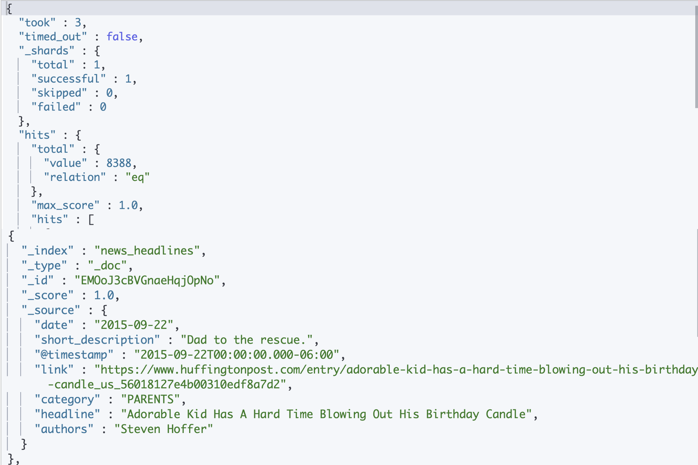

## Получение информации о кластере и нодах

Синтаксис:

```
GET _API/parameter
```

#### Запрос "health" кластера

```
GET _cluster/health
```

Ожидаемый ответ от Elasticsearch:


#### Запрос статистики по нодам

```
GET _nodes/stats
```

Ожидаемый ответ от Elasticsearch:


## СRUD операции

### C - Create (Запись)

#### Создать индекс

Синтаксис:

```
PUT Имя-Индекса
```

Пример:

```
PUT favorite_candy
```

Ожидаемый ответ от Elasticsearch:


#### Добавление документа

Можно использовать методы `POST` или `PUT`.

Метод `PUT` используем если хотим сохранить документ под конкретным ID.

##### Добавление документы с помощью метода `POST`:

Синтаксис:

```
POST Name-of-the-Index/_doc
{
  "field": "value"
}
```

Пример:

```
POST favorite_candy/_doc
{
  "first_name": "Lisa",
  "candy": "Sour Skittles"
}
```

Ожидаемый ответ от Elasticsearch:


##### Добавление документы с помощью метода `PUT`:

Синтаксис:

```
PUT Имя-Индекса/_doc/id-который-ты-выбрал-сам
{
    "field": "value"
}
```

Пример:

```
PUT favorite_candy/_doc/1
{
  "first_name": "John",
  "candy": "Starburst"
}
```

###### _create Endpoint

Если мы пытаемся создать новый документ и используем id который уже есть в системе, то документ будет перезаписан.
Чтобы подстраховаться мы можем использовать ручку _create

Синтаксис:

```
PUT Имя-Индекса/_create/id-который-ты-выбрал-сам
{
    "field": "value"
}
```

Пример:

```
PUT favorite_candy/_create/1
{
  "first_name": "Finn",
  "candy": "Jolly Ranchers"
}
```

Ожидаемый ответ от Elasticsearch:


### R - Read (Чтение)

#### Чтение документа

Синтаксис:

```
GET Имя-Индекса/_doc/id-документа
```

Пример:

```
GET favorite_candy/_doc/1
```

Ожидаемый ответ от Elasticsearch:


### U - UPDATE (Обновление/Изменение)

#### Изменение документа

Для обновления полей в документе, используйте синтаксис:

```
POST Имя-Индекса/_update/id-of-the-document-you-want-to-update
{
  "doc": {
    "field1": "value",
    "field2": "value",
  }
} 
```

Пример:

```
POST favorite_candy/_update/1
{
  "doc": {
    "candy": "M&M's"
  }
}
```

Ожидаемый ответ от Elasticsearch:


### U - UPDATE (Удаление)

#### Удаление документа

Синтаксис:

```
DELETE Name-of-the-Index/_doc/id-of-the-document-you-want-to-delete
```

Пример:

```
DELETE favorite_candy/_doc/1
```

Ожидаемый ответ от Elasticsearch


## Поиск информации

В Elasticsearch есть два направления поиска:

1) Queries - запросы
2) Aggregations - агрегирование

Endpoint для любого поиска:

```
GET название-индекса/_search
```

### Поиск документов с фильтром по дате

Синтаксис:

```
GET название-индекса/_search
{
  "query": {
    "Укажите_тип_запроса_здесь": {
      "Введите_название_поля_здесь": {
        "gte": "Введите_минимальное_значение_диапазона_здесь",
        "lte": "Введите_максимальное_значение_диапазона_здесь"
      }
    }
  }
}
```

Пример:

```
GET news_headlines/_search
{
  "query": {
    "range": {
      "date": {
        "gte": "2015-06-20",
        "lte": "2015-09-22"
      }
    }
  }
}
```

Запрос получит новости, опубликованные с 20 июня 2015 года по 22 сентября 2015 года.



Пример с пагинацией:

```
GET news_headlines/_search
{
  "query": {
    "range": {
      "date": {
        "gte": "2015-06-20",
        "lte": "2015-09-22"
      }
    }
  },
  "from": 10,
  "size": 10
}
```

### Агрегирование

Синтаксис:

```
GET название-индекса/_search
{
  "aggs": {
    "кастомное название результата агрегации": {
      "тип агрегации: {
        "field": "название поля",
        "size": сколько-результатов-вернуть
      }
    }
  }
}
```

Пример:

```
GET news_headlines/_search
{
  "aggs": {
    "by_category": {
      "terms": {
        "field": "category",
        "size": 10
      }
    }
  }
}
```

### Поиск с текстовым запросом

#### Запрос типа OR – `match`

По умолчанию, запрос типа `match` использует логику "ИЛИ" (OR). Если документ содержит одно из поисковых слов,
Elasticsearch считает этот документ подходящим.

Логика "ИЛИ" приводит к большему количеству результатов, тем самым увеличивая полноту поиска. Однако, так как результаты
могут быть лишь отдалённо связаны с запросом, это снижает точность.

Синтаксис:

```
GET название-индекса/_search
{
  "query": {
    "match": {
      "Укажите_поле_для_поиска": {
        "query": "введите-ваш-текстовый-запрос"
      }
    }
  }
}
```

Пример:

```
GET news_headlines/_search
{
  "query": {
    "match": {
      "headline": {
        "query": "internet business"
      }
    }
  }
}
```

Ожидаемый ответ от Elasticsearch:


#### Запрос типа AND – `match_phrase`

`match_phrase`- ищет полную подстроку

```
GET название-индекса/_search
{
  "query": {
    "match_phrase": {
      "Укажите_поле_для_поиска": {
        "query": "введите-ваш-текстовый-запрос"
      }
    }
  }
}
```

Пример:

```
GET news_headlines/_search
{
  "query": {
    "match_phrase": {
      "headline": {
        "query": "internet business"
      }
    }
  }
}
```

Ожидаемый ответ от ElasticSearch:


#### Нечеткий поиск - `Fuzzy`

Допустим, юзер хотел поискать "Apple", но ошибся и ввел "aple"

```
GET название-индекса/_search
{
  "query": {
    "fuzzy": {
      "field_name": {
        "value": "aple",
        "fuzziness": "AUTO"
      }
    }
  }
}
```

Пример:

```
GET news_headlines/_search
{
  "query": {
    "fuzzy": {
      "short_description": {
        "value": "aple",
        "fuzziness": "AUTO"
      }
    }
  }
}
```

Ожидаемый ответ от Elasticsearch:


#### Поиск по нескольким полям

Пример:

```
GET news_headlines/_search
{
  "query": {
    "multi_match": {
      "query": "craft beer",
      "fields": [
        "headline^3",  // Увеличиваем вес для заголовка
        "short_description",
        "category"
      ]
    }
  }
}
```